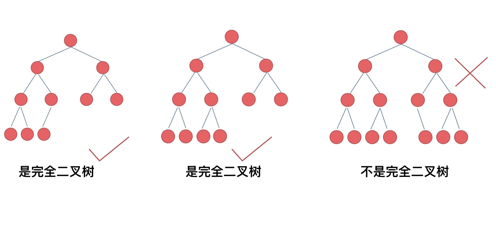

## Record

### Apr 1, 2024

今日2题：

875. Koko Eating Bananas
    
    trick: use res = min(res, new_res) to keep track of the best result

153. Find Minimum in Rotated Sorted Array
    
    "write an algorithm that runs in O(log n) time" --> immediately think about Binary Search


### Apr 2, 2024

Joined leetcode-master bootcamp:

https://github.com/youngyangyang04/leetcode-master

useful tools can be found in: 

https://www.yuque.com/chengxuyuancarl/wnx1np/ktwax2


**Tips for Debugging**

1. for循环内部出现问题: print i 来定位轮次
```Java
for(int i = 0; i < n; i ++){
    //输出语句
    System.out.println(i + " " + 任意你下面可能用到的变量);  
    一系列逻辑操作
    System.out.println(i + " " + 任意你上面用到的变量);
    //注意i是必须要有的可以看轮次,如果一系列操作出出现了异常可以定位出第几次
}
```


2. 链表出现问题,空针异常:
```Java
ListNode list = new ListNode();
ListNode next = list.next;
int cnt = 0; //标记轮次
    while(判断逻辑){
        逻辑操作
		System.out.println(cnt + "  " + list.val + " "  + next.val+ " " + 你想加的); //出现空针异常可以看一下上一轮的值
        cnt ++;
        //上面的找不出问题继续
        System.out.println((list.next == next) + " " + 一系列可能引起空针或者环的操作或者值或者地址)  
    }
```


3. 数组越界问题
```Java
int cnt = 0; // 用来定位, 如果for循环可以每次都声明一次这个没关系的
System.out.println(cnt + " " + 下标); 
// 用到下标的任意代码
cnt ++;
System.out.println(cnt + " " + 下标);
//找到没有打的输出语句的前一轮次可以定位问题,因为我们的日志也打了输出语句所以你可以看到下标是多少
```

4. 判断是否进入if
```Java
if(){
    //任意输出
}
//如果没进入在if上面打输出语句看你的变量是否正确
```

5. 树递归
```Java
int cnt = 0;//轮次变量
void f(TreeNode root){ //递归的方法
    if(root == null) System.out.println(cnt); //放空针异常
    else System.out.println(root.val +  " " + cnt); //根据root.val和cnt来判断到哪个节点了
    cnt ++;
    //逻辑操作(可能含有递归,没关系我们的cnt是全局的)
    if(root == null) System.out.println(cnt); //放空针异常
    else System.out.println(root.val +  " " + cnt);
    cnt ++;
} 
//再来个层序
while(!q.isEmpty()){
    //任何获取到TreeNode后的操作和需要用到TreeNode的地方之前打一个输出即可
    //操作前操作后都需要打！！！！！！！！！！！
}
```


今日2题：

704. Binary Search
    
    **一种更好的求mid的方法**
    我之前的： int mid = (left + right) / 2;
    更好的：int mid = left + ((right - left) >> 1);
        `(right - left)`: 这个部分计算的是left和right之间的距离或者说是它们的差值。这个差值表示了从left到right有多少个元素间隔。
        `>> 1`: 这个操作是位运算中的右移操作。将任何数字右移1位，效果等同于将该数字除以2。
    这种计算中点的方式有2个好处：
    防止溢出：直接使用(left + right) / 2可能在left和right都很大的时候导致整数溢出。通过先计算差值然后再加上left，可以避免这个问题。
    效率：位运算的效率通常高于除法运算。
    

27. Remove Element
    
    two pointers不只是一左一右的，也可以两个都在左边起点。


### Apr 3, 2024

今日2题：

977. Squares of a Sorted Array
    
    很简单。秒了。也是two pointers。
    
```Python3
    for i in range(len(nums)):
    nums[i] = nums[i] * nums[i]
    // Tip: 关于square a array，下面这样写更优雅。
    nums = [num * num for num in nums]
```

121. Best Time to Buy and Sell Stock

    我的做法是先算出每天的profit变化，然后找max_profit，我的答案在memeory上优于97.5%的答案。但另一种方式更直观更简单：https://youtu.be/1pkOgXD63yU
    
    我原本困惑的点在于为什么prices[r] <= prices[l]就要l += 1。
    其实很简单，当第二天没有利润的时候，说明股票跌了，那么这个时候入手，肯定比之前入手要好。所以不用担心前一天的价格还没有loop完不知道结果，因为不管怎么样从后面一天入手都更好。所以直接将左边的pointer移到现在的最低价位处，l = r。
    
3. Longest Substring Without Repeating Characters    
    
    我原本以为set()里element的顺序是随机的，但其实set()是有顺序的，dictionary里的才没有，之后不要弄混了。所以，可以用`charSet = set()`来记录char出现过的顺序。

    其次，滑窗的时候要注意是用while而不是if，只要条件满足，就应该继续滑动。
    
    滑窗 = 用一个for循环来完成暴力解法两个for循环才能完成的事。for里循环的是r（终点位置），我们自己需要想办法移动l（起点位置）。for循环会一次一次奖终点位置向后移动，当满足条件时，我们自动起点位置，来试图更加逼近条件。
    https://www.bilibili.com/video/BV1tZ4y1q7XE/
    
    `min_len = float('inf')` 这行代码在Python中的意思是将变量`min_len`初始化为无穷大。在Python中，`float('inf')`表示正无穷大，而`float('-inf')`表示负无穷大。将变量初始化为无穷大在某些算法中非常有用，特别是在需要找到最小值的情况下。
    初始化`min_len`为无穷大的目的是为了确保在后续的比较中，任何实际的、有限的长度值都会小于`min_len`。这样，第一次比较就可以成功更新`min_len`为一个实际的长度值。这种方法常用于求最小值的问题。

59. Spiral Matrix II
    
    four pointers: left, right, top, bottom.
    
    When to terminate the loop? When left cross right, top cross bottom.
    
    Neetcode老哥讲得太好了：https://youtu.be/RvLrWFBJ9fM
    
    
### Apr 23, 2024

Linked List问是否有环(loop) -> 快慢指针

找环形入口： x = z


### Apr 24, 2024

什么用哈希法？-> **当我们遇到需要判断一个元素是否出现过的场景，第一时间想到哈希法！**
这句话很重要，大家在做哈希表题目都要思考这句话。 
比如在202. Happy Number里，需要判断一个sum是否重复出现过，就可以使用哈希法，用一个unordered set来判断sum是否出现过。

**常见的三种哈希结构：**
当我们想使用哈希法来解决问题的时候，我们一般会选择如下三种数据结构：
**数组
set（集合）
map（映射)**
哈希法牺牲了空间换取了时间，因为我们要使用额外的数组，set或者是map来存放数据，才能实现快速的查找。

**divmod(n1, n2)的用法：**
n, r = divmod(112, 10): 
先div(n = 112 // 10 = 11), 然后mod(r = 112 % 10 = 2)

**.index(n):** 可以通过nums.index(n)来获取某一个数在List里的index。

**2sum**用hashset，**3sum**和**4sum**用two pointers(l, r)，4sum就是在3sum上多套了一个loop而已。


### Apr 25, 2024

今天在练习字符串，下面这个python的写法很巧妙，学习一下。
541. Reverse String II
```class Solution:
    def reverseStr(self, s: str, k: int) -> str:
        # Two pointers. Another is inside the loop.
        p = 0
        while p < len(s):
            p2 = p + k
            # Written in this could be more pythonic.
            s = s[:p] + s[p: p2][::-1] + s[p2:]
            p = p + 2 * k
        return s
```

**双指针法**是字符串处理的常客。
**双指针法的效率优势**：通过两个指针在一个for循环下完成两个for循环的工作，将O(n^2)的时间复杂度降为O(n)。

其实很多数组（字符串）填充类的问题，都可以先预先给数组扩容带填充后的大小，然后在**从后向前**进行操作。
为什么要从后向前填充，从前向后填充不行么？从前向后填充就是O(n^2)的算法了，因为每次添加元素都要将添加元素之后的所有元素向后移动。


**KMP算法**是字符串查找最重要的算法。
还剩KMP算法没看，明天起来看一下，一刷可以先不用完全搞懂。


### Apr 26, 2024

今天开始练stack和queue

**232. Implement Queue using Stacks**
用两个stack模拟queue

**225. Implement Stack using Queues**
用一个deque模拟stack

有点晕。多练练。


Stack是叠起来的，LIFO，越靠后进去的越先出来。
Queue是一队列的，FIFO，最先进去的最先出来。

20. Valid Parentheses
要注意检查stack是不是空了(if stack)，如果空了就不能pop了；并且，结束的时候如果不是空的，就说明就问题。


1047. 删除字符串中的所有相邻重复项 

Stack的经典应用。Stack很适合这种类似于消消乐的操作（匹配问题都是栈的强项！），因为stack帮助我们记录了，遍历数组当前元素时候，前一个元素是什么。


**⚠️注意：int() 和 //(integer division) 不一样，在负数时是有区别的**
int()是向0取整，//是向下取整。

- `int(-13 / 5)` results in `-2` -- 向0取整
- `-13 // 5` results in `-3` -- 向下取整

正数时看似一样，但实则内在逻辑不同：
- `13 // 5` results in `2` -- 向0取整
- `int(13 / 5)` results in `2` -- 向下取整

这么看的话，计算类的题里用int()应该更普遍。


一道有意思的hard：
239. Sliding Window Maximum
如果不是两侧滑动窗口，只增加数字不减少数字的话，用一个大顶堆（优先级队列/max-heap）来存放数字，每次只能弹出最大值，就行了。但问题是，这个窗口是固定长度滑动的，每一次增加一个数字，都会减少一个数字，而大顶堆记录的是所有见到过的最大值，而不是滑动窗口里面的所有数值。

这道题，我们要用到**单调队列(Monotonic Queue)**，即单调递减(non-increasing)或单调递增(non-decreasing)的队列。这个队列没有必要维护窗口里的所有元素，只需要维护有可能成为窗口里最大值的元素就可以了，同时保证队列里的元素数值是由大到小的。

**pop():** 每次pop的时候，比较当前要pop的数值是否是队列前端出口的数值(也就是说我们要pop的这个值是当前记录的最大值)，如果是最大值，就说明这一步里窗口从最大值划走了，于是，把之前记录的最大值pop掉，我们需要重新找最大值了。**-> 这就解决了我们记录的是滑动窗口里面的最大值。**
**push():** 如果push进去的数值大于后段入口元素的数值，那么就将队列后端的数值pop掉（因为我们找到比这个数更大的值了），一直pop到要push进去的数值小于等于队列入口元素的数值为止。**-> 这样就保持了队列里的数值是单调从大到小的了。
**


347. Top K Frequent Elements

这道题有很多坑，可以多练几遍。我之前是用hash table做的，这次知道了也可以用heap(priority queue)做。

**小顶堆每次将最小的元素弹出** 用于统计最大前k个元素 -> 小顶堆每次将最小的元素弹出，最后剩下的就是前k个最大元素。
**大顶堆每次将最大的元素弹出** 用于统计最小前k个元素 -> 大顶堆每次将最大的元素弹出，最后剩下的就是前k个最小元素。

Python 的 heapq 默认提供的是小顶堆，需要将优先级取负来实现最大堆。
```
    默认小顶堆：heapq.heappush(min_heap, (priority, task))
    取负变成大顶堆：heapq.heappush(max_heap, (-priority, task))
```
Java 的 PriorityQueue 默认是小顶堆，需要自定义比较器来实现最大堆。
```
    默认小顶堆：PriorityQueue<Integer> minHeap = new PriorityQueue<>();
    加反转器变成大顶堆：PriorityQueue<Integer> maxHeap = new PriorityQueue<>(Collections.reverseOrder());
    
    * 默认的小顶堆其实相当于：PriorityQueue<Integer> minHeap = new PriorityQueue<>(Integer::compareTo);
    Integer::compareTo是按照自然升序（由小到大）来排序的

```

C++ 的 priority_queue 默认是大顶堆，需要自定义比较器来实现最小堆。
```
    默认大顶堆：priority_queue<int> maxHeap;
    priority_queue<int, vector<int>, greater<int>> minHeap;
    
    * 默认的小顶堆相当于：priority_queue<int, vector<int>, less<int>> minHeap;
    只不过less被默认省略去了
    
    - int：这是队列中存储的元素的类型。在这个例子中，队列将存储整数。
    - vector<int>：这是底层容器类型，用于实际存储队列中的数据。priority_queue 可以使用任何提供随机访问迭代器和支持 back(), push_back(), 和 pop_back() 操作的容器类型。vector 是最常用的容器类型，但也可以使用deque。
    - less<int>：这是一个比较类或函数，用于确定元素的排序方式。less<int> 即元素较大者具有更高的优先级，因此实际上是一个最大堆。
```

std::priority_queue<int, std::vector<int>, std::greater<int>> minHeap;


### Apr 26, 2024

今天开始二叉树啦哈哈哈！

**平衡二叉搜索树 AVL(Adelson-Velsky and Landis)**
它是一棵空树，或它的左右两个子树的高度差的绝对值不超过1，
并且，左右两个子树都是一棵平衡二叉树。


C++中map、set、multimap，multiset的底层实现都是平衡二叉搜索树，所以map、set的增删操作时间时间复杂度是logn，注意我这里没有说unordered_map、unordered_set，unordered_map、unordered_set底层实现是哈希表。


### **二叉树的储存**
二叉树可以链式存储(用指针)，也可以顺序存储(用数组)。
用链式表示的二叉树，更有利于我们理解，所以一般是用链式存储二叉树。但是要了解，用数组依然可以表示二叉树。
如果是用数组来存储二叉树（如下图），应该如果遍历呢？

**数组二叉树：如果父节点的数组下标是 i，那么它的左孩子就是 i * 2 + 1，右孩子就是 i * 2 + 2。**


### **如何定义一棵二叉树？**
在刷leetcode的时候，节点的定义都默认定义好了，但真到面试的时候，面试官可能要求手写代码，需要自己写节点定义的时候，当心一脸懵逼！所以一定要用白纸练习，自己记住并写下来。

C++:

```C
struct TreeNode {
    int val;
    TreeNode *left;
    TreeNode *right;

    // 初始化节点的方式1: 无参构造函数
    TreeNode() : val(0), left(nullptr), right(nullptr) {}
    // 初始化节点的方式2: 单参数构造函数
    TreeNode(int x) : val(x), left(nullptr), right(nullptr) {}
    // 初始化节点的方式3: 三参数构造函数
    TreeNode(int x, TreeNode *left, TreeNode *right) : val(x), left(left), right(right) {}
};

```
Java:
```Java
public class TreeNode {
    int val;
    TreeNode left;
    TreeNode right;
    
    // 在Java中，一个class/struct可以定义多个构造函数，就像在C++中一样
    // 初始化节点的方式1: 无参构造函数
    TreeNode() {}
    // 初始化节点的方式2: 单参数构造函数
    TreeNode(int val) { this.val = val; }
    // 初始化节点的方式3: 三参数构造函数
    TreeNode(int val, TreeNode left, TreeNode right) {
        this.val = val;
        this.left = left;
        this.right = right;
    }
}
```

Python:
```Python
class TreeNode:
    # 在Python中，class的构造函数是通过定义__init__方法来实现的。
    # __init__方法接受了三个默认参数值 (val, left, right)
    # 得益于此，只需要一个__init__方法就能涵盖多种初始化场景，使得创建树节点时非常灵活。
    def __init__(self, val, left = None, right = None):
        self.val = val
        self.left = left
        self.right = right
```


### **二叉树的遍历方式**

二叉树主要有两种遍历方式：
广度优先遍历(BFS)：一层一层的去遍历。
深度优先遍历(DFS)：先往深走，遇到叶子节点再往回走。

在深度优先遍历(DFS)中，又有三个顺序:前、中、后序遍历。
记住前中后序指的就是中间节点的位置顺序就可以了。
**前序**遍历：**中**左右
**中序**遍历：左**中**右
**后序**遍历：左右**中**


那么，遍历二叉树需要使用什么**数据结构**呢？这里就又是一个**stack和queue**的应用场景。
**DFS -> stack**
DFS里的前中后序遍历的逻辑可以借助stack使用递归的方式来实现，因为栈其实就是递归的一种实现结构。(这里没懂，接下来再看)
**BFS -> queue**
而BFS的实现一般使用queue来实现，因为需要先进先出(FIFO)的结构，才能一层一层地来遍历二叉树。


### **二叉树的递归遍历**

写递归，不能靠玄学，应该按照以下三个要素来写，可以保证写出正确的递归算法！
1. 确定每一轮递归中：需要处理什么参数 -> 在递归函数里加上这个参数
                  & 需要返回什么值 -> 确定递归函数的返回类型。
2. 确定递归的终止条件： 写完了递归算法, 运行的时候，经常会遇到stack溢出的错误，就是没写终止条件或者终止条件写的不对，操作系统也是用一个stack的结构来保存每一层递归的信息，如果递归没有终止，操作系统的内存stack必然就会溢出。
3. 确定单层递归的逻辑： 确定在每一层递归里，需要怎么样去处理的参数。

```C
class Solution {
public:

    // 在C++和Java中, Class里的所有方法都会在编译时被收集，
    // 所以可以在一个Class的任何位置调用同一个Class里的其他方法，
    // 而不用担心方法定义的先后顺序。
    vector<int> preorderTraversal(TreeNode* root) {
        vector<int> result;
        traversal(root, result);
        return result;
    }

    // 确定递归函数的参数(current node和存放val的vector)和返回值(void)
    void traversal(TreeNode* cur, vector<int>& vec) {
        // 确定终止条件
        if (cur == NULL) return;
        // 确定单层递归的逻辑
        vec.push_back(cur->val);    // 中（处理参数）
        traversal(cur->left, vec);  // 左
        traversal(cur->right, vec); // 右
    }
};

```

```Java
class Solution {

    public List<Integer> preorderTraversal(TreeNode root) {
        List<Integer> res = new ArrayList<Integer>();
        traversal(root, res);
        return res;
    }
    
    public void traversal(TreeNode currNode, List<Integer>res) {
        if currNode == null {
            return;
        }
        res.add(currNode.val);
        traversal(currNode.left, res);
        traversal(currNode.right, res);
    }
}
```

```python
class Solution:    
    def preorderTraversal(self, root: TreeNode) -> List[int]:
        res = []
        
        # 确定递归函数的参数和返回值
        def traversal(current_node):
            # 确定终止条件
            if current_node is None:
                return
            # 确定单层递归的逻辑
            res.append(current_node.val)  # 中
            traversal(current_node.left)  # 左
            traversal(current_node.right) # 右
        
        # 在Python中，必须先定义函数后使用，
        # 因为Python是动态解释执行的语言，它在运行时逐行解释代码，对顺序敏感。
        traversal(root)
        return res
```


### **递归与迭代**
**迭代 (Iteration)**
想象你在爬楼梯，你知道每一步都要做什么：提脚、向上走一阶。你重复这个过程，一步接一步，直到到达楼梯顶端。这就是迭代：重复一个动作或步骤，每次都是一样的，直到完成任务。

**递归 (Recursion)**
想象你在组装一套俄罗斯套娃。你打开最大的娃娃，里面还有一个稍小的娃娃。你接着打开这个小娃娃，里面又有一个更小的，以此类推，直到最小的那个娃娃（**“递”**）。然后你开始一个个地把小娃娃装回大娃娃里，直到全部装完（**“归”**）。递归就是这样：开始一个任务，发现你可以通过做一个更小的、类似的任务来完成它，这个小任务又需要完成一个更小的任务，直到达到最简单的形式，然后你开始逐步传递返回去，直到整个大任务完成。
当你发现一道题需要写很多个类似的for loop来解时，多半是可以用recursion来写的。

迭代像是一步步走楼梯走到楼顶，而递归像是解开一层层套在一起的套娃再装回去！


### **用迭代法遍历二叉树（使用stack）**

**前序遍历（用stack访问&处理）**
先前已经讲到，前序遍历是中左右，每次先处理的是中间节点。
因此，我们先将root放进stack里，然后将right child加入stack，再加入left child。
为什么要先加入right，再加入left呢？ 因为stack是先入后出(FILO)，right要比left先进栈，出栈的时候才能比left后出栈（中->左->右）

**后序遍历（用stack访问&处理）**
迭代法的后序遍历的方法非常巧妙！后序遍历是左右中。
刚刚前序遍历是中左右，反转一下result的话是右左中 
-> 也就是说，稍微改一下前序遍历，交换左右节点的顺序，把它变成中右左，然后再反转，就是左右中啦！！！

**中序遍历（用pointer访问+用stack处理）**
迭代法的中序遍历比较tricky。上面的前序和后序的代码不能和中序通用。
这是因为，在迭代的过程中，我们其实有两个操作：1）访问节点 2）处理节点
在前序遍历（中左右）和后序遍历（反转前，即中右左）里，我们先访问的是中间节点，然后处理的也是中间节点，——要访问的元素和要处理的元素顺序是一致的。
然而，在中序遍历（左-中-右）里，我们在访问了中间节点后(root)，并不直接处理中间节点，而是一层一层向下访问，直到达到树左面的最底部，然后才开始处理节点（左）。因此，中序遍历里，处理顺序并不和访问顺序一致。
因此，用迭代法写二叉树的中序遍历时，我们不用stack来访问节点，只用stack来处理节点，而另外加一个指针遍历来访问节点。

C++：
```C
class Solution {
public:
    vector<int> inorderTraversal(TreeNode* root) {
        vector<int> result;
        stack<TreeNode*> stack;
        TreeNode* current_node = root; // 创建一个指针用于访问节点
        while (current_node != NULL || !stack.empty()) {
            if (current_node != NULL) {
                stack.push(current_node);
                current_node = current_node->left; // 左
            } else {    // 当指针访问到了最底层 -> 可以开始处理stack里的节点了！
                current_node = stack.top();
                stack.pop();
                result.push_back(cur->val);     // 中
                cur = cur->right;               // 右
            }
        }
        return result;
    }
};
```
python的好懂一些：
```python
class Solution:
    def inorderTraversal(self, root: TreeNode) -> List[int]:
        if not root:
            return []
        stack = []  # 不能提前将root结点加入stack中（因为root是中不是左）
        result = []
        cur = root  # 指针
        while cur or stack: # 当还有没处理过的节点时（没访问、访问了还没处理）：
            if cur:     # 如果还有没访问过的节点，继续访问
                stack.append(cur)
                cur = cur.left		
            else:		# 访问完了，开始处理stack里的节点了
                cur = stack.pop()
                result.append(cur.val)
                cur = cur.right	
        return result
```

那有没有什么办法，能让前序、中序、后序的迭代一致一点呢？？请看⬇️：

### **二叉树的统一迭代法**
有点复杂，详情请见[二叉树的统一迭代法](https://programmercarl.com/%25E4%25BA%258C%25E5%258F%2589%25E6%25A0%2591%25E7%259A%2584%25E7%25BB%259F%25E4%25B8%2580%25E8%25BF%25AD%25E4%25BB%25A3%25E6%25B3%2595.html#%25E5%2585%25B6%25E4%25BB%2596%25E8%25AF%25AD%25E8%25A8%2580%25E7%2589%2588%25E6%259C%25AC)
**思路：在要处理的节点放入stack之后，紧接着放入一个空指针作为标记，这样在pop stack的时候，如果pop到空指针，就知道下一个pop的节点是需要处理的节点了！！**
画出树来跟着走一遍好懂很多。复习时再画一次。第一次刷题可以暂时放过。

### 二叉树的层序遍历（BFS）
很简单，就是要注意一个corner case：当root为None时，马上return。
if not root:
    return [] 
否则root被加进queue之后，queue=[None]，queue不为空，会进入遍历循环！
**[] is empty.
[None] is not empty!!!**


199.二叉树的右视图
给定一棵二叉树，想象自己站在它的右侧，按照从顶部到底部的顺序，返回从右侧所能看到的节点值。
思路：层序遍历的时候，判断是否遍历到单层的最后面的元素，如果是，就放进result数组中，随后返回result就可以了！

**extend()和append（）**
**append()**: queue.append([1, 2, 3]) -> the entire list [1, 2, 3] is added as one element to the queue -> queue = [[1, 2, 3]]
**extend()**: queue.extend([1, 2, 3]) -> it adds 1, 2, and 3 as separate elements to the queue -> queue = [1, 2, 3]

116.填充每个节点的下一个右侧节点指针
技巧：用**prev_node**记录前一个节点，然后在遍历的时候让前一个节点指向本节点就可以了！

一口气打完了以下十题哈哈！
102.二叉树的层序遍历(opens new window)
107.二叉树的层次遍历II(opens new window)
199.二叉树的右视图(opens new window)
637.二叉树的层平均值(opens new window)
429.N叉树的层序遍历(opens new window)
515.在每个树行中找最大值(opens new window)
116.填充每个节点的下一个右侧节点指针(opens new window)
117.填充每个节点的下一个右侧节点指针II(opens new window)
104.二叉树的最大深度(opens new window)
111.二叉树的最小深度


### May 04, 2024

今天来学求二叉树的最大深度！

倒着想，从叶节点往上去想，那就不是深度，而是根节点的高度！

求深度是从上到下去查 所以是前序遍历（中左右）
求高度是从下到上去查，所以是后序遍历（左右中）

用后序遍历（左-右-中）来计算树的高度

还是用递归三部曲来思考：
1. 确定递归函数的参数和返回值：参数就是传入树的根节点，返回就返回这棵树的深度，所以返回值为int类型。
    ```
    int getdepth(TreeNode* node)
    ```
2. 确定终止条件：如果为空节点的话，就返回0，表示当前高度为0。
    ```
    if (node == NULL) return 0;
    ```
3. 确定单层递归的逻辑：先求它的左子树的深度，再求右子树的深度，最后取左右深度最大的数值 再+1 （加1是因为算上当前中间节点）就是目前节点为根节点的树的深度/高度。
    ```
    int leftdepth = getdepth(node->left);       // 左
    int rightdepth = getdepth(node->right);     // 右
    int depth = 1 + max(leftdepth, rightdepth); // 中
    return depth;
    ```
上手练了这三道，感觉很好！    
104. Maximum Depth of Binary Tree
https://leetcode.com/problems/maximum-depth-of-binary-tree/description/
559. Maximum Depth of N-ary Tree
https://leetcode.com/problems/maximum-depth-of-n-ary-tree/description/
111. Minimum Depth of Binary Tree
https://leetcode.com/problems/minimum-depth-of-binary-tree/description/   
 

**完全二叉树**
完全二叉树：
除了最底层的节点可能没填满外，其余每层都填满了节点
并且最下面一层的节点都集中在该层的最左边。
若最底层为第 h 层，则该层包含 1 ～ 2^(h-1)  个节点。

222. Count Complete Tree Nodes 这道题很有意思
https://leetcode.com/problems/count-complete-tree-nodes/description/
完全二叉树只有两种情况，情况一：就是满二叉树，情况二：最后一层叶子节点没有满。
对于情况一，可以直接用 2^树深度 - 1 来计算，注意这里根节点深度为1。
对于情况二，分别递归左孩子，和右孩子，递归到某一深度一定会有左孩子或者右孩子为满二叉树，然后依然可以按照情况1来计算。

```python
class Solution: # 利用完全二叉树特性
    def countNodes(self, root: TreeNode) -> int:
        if not root: return 0
        count = 1
        left = root.left; right = root.right
        while left and right:
            count+=1
            left = left.left; right = right.right
        if not left and not right: # 如果同时到底说明是满二叉树，反之则不是
            return 2**count-1 # 直接计算节点数，不用层层递归了
        # 否则，说明不是满二叉树，不能直接计算，按老方法递归
        return 1+self.countNodes(root.left)+self.countNodes(root.right) 
```


**平衡二叉树**
分别求出其左右子树的高度（求高度用后序遍历：左右中），然后左右子树高度差值小于等于1，返回当前二叉树的高度，否则返回-1，表示已经不是二叉平衡树了。


### May 05, 2024
257. Binary Tree Paths
https://leetcode.com/problems/binary-tree-paths/description/
很巧妙！配合代码随想录好好看。一定要按照递归三部曲去思考，否则是乱的。
https://programmercarl.com/0257.%E4%BA%8C%E5%8F%89%E6%A0%91%E7%9A%84%E6%89%80%E6%9C%89%E8%B7%AF%E5%BE%84.html#%E6%80%9D%E8%B7%AF

404. 左叶子之和
判断一个树的左叶子节点之和，那么一定要传入树的根节点，递归函数的返回值为数值之和，所以为int。因此，使用题目中给出的函数就可以了。
-> 也就是说，需不需要再写一个新函数，是根据原本提供的函数能不能满足要求来看的，如果原本的满足，就不需要！

### May 06, 2024

**递归函数什么时候需要返回值？什么时候不需要返回值？**
总结如下三点：
1. 如果需要搜索整棵二叉树且不用处理递归返回值，递归函数就不要返回值。（这种情况就是本文下半部分介绍的113.路径总和ii）
2. 如果需要搜索整棵二叉树且需要处理递归返回值，递归函数就需要返回值。 （这种情况我们在236. 二叉树的236.最近公共祖先中介绍）
3. 如果要搜索其中一条符合条件的路径，那么递归一定需要返回值，因为遇到符合条件的路径了就要及时返回。（112.路径总和i）

236.找二叉树的最近公共祖先：
遇到这个题目首先想的是要是能自底向上查找就好了，这样就可以找到公共祖先了。
那么二叉树如何可以自底向上查找呢？答案是：回溯啊，二叉树回溯的过程就是从低到上。
**后序遍历（左右中）就是天然的回溯过程，可以根据左右子树的返回值，来处理中节点的逻辑。**


## 岛屿问题

```python

class Solution:
    # 把这块土地上下左右的土地都标记成visited过的土地
    def bfs(self, grid: List[List[str]], visited: List[List[str]], x, y):
        direction = [(0, 1), (1, 0), (0, -1), (-1, 0)]
        queue = deque([(x, y)])
        visited[x][y] = True
        while queue:
            curx, cury = queue.popleft()
            for dx, dy in direction:
                nextx, nexty = curx + dx, cury + dy
                if nextx < 0 or nextx >= len(grid) or nexty < 0 or nexty >= len(grid[0]):
                    continue
                if not visited[nextx][nexty] and grid[nextx][nexty] == "1":
                    queue.append((nextx, nexty))
                visited[nextx][nexty] = True
                

    def numIslands(self, grid: List[List[str]]) -> int:
        m, n = len(grid), len(grid[0])
        visited = [[False] * n for _ in range(m)]
        count = 0
        # 这个循环用于寻找“第一块土地”
        for i in range(m):
            for j in range(n):
                if (visited[i][j] == False) and (grid[i][j] == "1"):
                    count += 1
                    self.bfs(grid, visited, i, j)
        return count

```